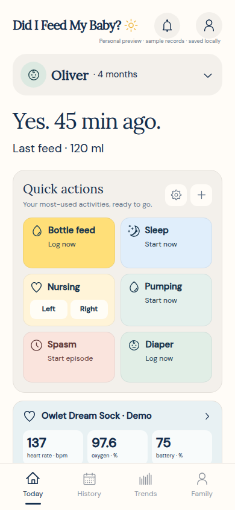
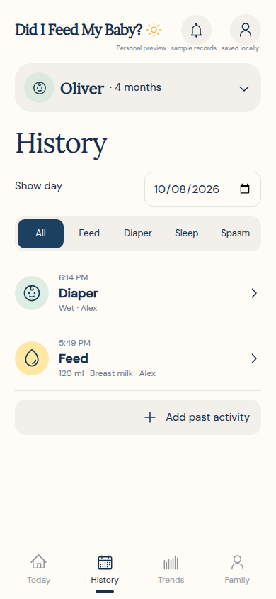
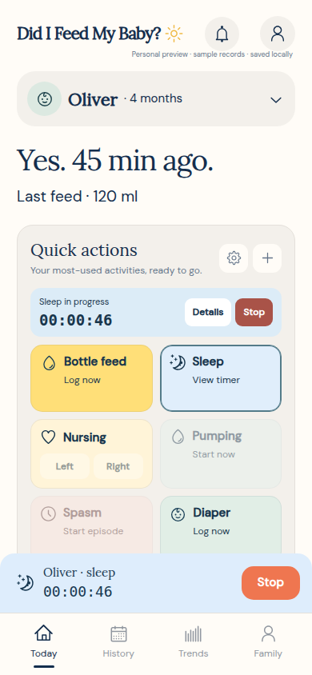
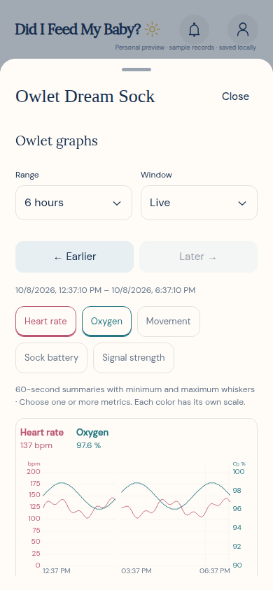
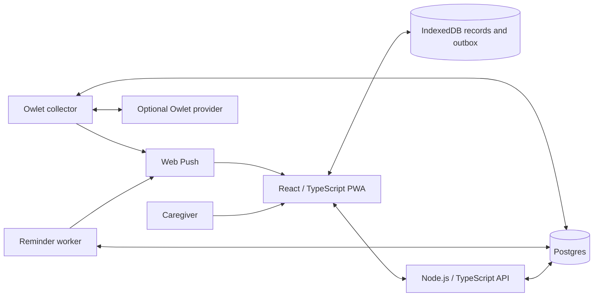

<p align="center">
  
</p>

<h1 align="center">Did I Feed My Baby?</h1>

<p align="center">
  A shared baby-care log for the moments when everyone is tired and nobody remembers who did what.
</p>

<p align="center">
  
  
  
  
</p>

<p align="center"><strong>Mobile first · Offline care logging · Shared households · Self hosted</strong></p>

## See it in action

These are real screenshots of the implemented PWA at a 390 × 844 mobile viewport. Oliver, Alex, the care entries, and the Owlet readings are **synthetic demo data**; no family records or live device measurements are shown.

<table>
  <tr>
    <th>Today</th>
    <th>Activity history</th>
  </tr>
  <tr>
    <td></td>
    <td></td>
  </tr>
  <tr>
    <th>Persistent sleep timer</th>
    <th>Owlet demo graph</th>
  </tr>
  <tr>
    <td></td>
    <td></td>
  </tr>
</table>

See [screenshot provenance and capture steps](docs/screenshots/README.md).

## What it does

- **Fast care logging:** Bottle feeds, nursing, pumping, diapers, sleep, solids, growth, medication, milestones, and spasm episodes. Each caregiver can customize the Today shortcuts.
- **Timers that survive app switches:** Start and stop from Today, pause and resume nursing segments, and correct entries later. Elapsed time comes from stored timestamps.
- **Shared household records:** Individual accounts, owner-managed invitations, child profiles, and a common activity history. Pregnancy and postpartum entries belong to adult profiles.
- **Offline recording and recovery:** IndexedDB retains records and pending uploads; the app retries when open or returning to the foreground. Revision conflicts stop automatic upload and offer export/recovery.
- **History and trends:** Browse a day, filter activities, and compare sleep, feeding, or diaper totals over 7 or 30 completed days. Light and dark appearances cover the app and its sheets.
- **Portable data:** CSV and JSON exports, plus Nara CSV import with duplicate detection, profile mapping, original fields, and byte-preserved source files in the household backup.
- **Optional Owlet integration:** A separate worker collects readings and poll archives; graphs combine independently selectable metrics, activity markers, missing-data gaps, and longer-range summaries with minimum/maximum whiskers. Per-child thresholds and notification history support explicit alert acceptance.

## Try the demo in five minutes

**Requirements:** Node.js 24 and npm. No database, account, or Owlet credentials are needed for the demo.

From the repository root:

```sh
git clone https://github.com/AaronCampbellit/baby-tracker-pwa-public.git
cd baby-tracker-pwa-public/web
npm ci
npm run dev:pwa
```

Open [http://localhost:4175/pwa.html?demo=1](http://localhost:4175/pwa.html?demo=1). The `pwa.html` entry runs the app directly in your browser; `npm run dev` serves the same native PWA. The older device-frame prototype is excluded from this publication candidate because its redistribution provenance was unverified.

1. Check **Today** for the last feed and quick actions.
2. Start **Sleep**, reload the page, and confirm the timer continues. Stop it and save the entry.
3. Open **History** to inspect or edit the sample entries. **Trends** uses completed days, so the initial sample has no historical totals.
4. Open the **Owlet Dream Sock · Demo** card to explore synthetic graphs. Choose a metric's **Open details** control to inspect readings.
5. Explore **Family** for local profiles, exports, and appearance settings.

Demo changes stay in this browser's local storage. Clear site data or use a fresh browser profile to reset the sample. Household sharing, server reminders, and real Owlet collection require the backend. The development server does not register the production service worker; use the Docker build below to try installation and offline reload.

## Architecture and engineering choices



| Decision | Why it matters |
| --- | --- |
| Timestamp-based timers | Reconstruct elapsed time after reload or suspension instead of depending on a background JavaScript interval. Nursing segments support pause/resume. |
| Durable local outbox | Store pending snapshots and operation IDs in IndexedDB. Retries reuse the in-flight operation; edits made during an upload drain afterwards. |
| Optimistic revisions | Detect concurrent household edits and stop for review rather than silently overwrite another caregiver's records. Fine-grained merging remains a limitation. |
| Foreground reconnect handling | Retry on online, focus, page restoration, and visibility events, plus a five-second interval while visible. A closed iOS PWA cannot reliably wake merely because connectivity returns. |
| Separate workers | Keep reminder delivery and Owlet polling independent of browser tabs. Owlet collection targets five seconds and backs off on provider failures. |
| Explicit alert acceptance | Preserve a repeating alert until the server confirms a caregiver's acceptance. Charging pauses depend on fresh, explicit provider reports. |
| Data provenance | Retain original Nara files and Owlet poll/file metadata alongside the normalized timeline, with export paths for recovery. |

The production service worker caches the app shell and built JavaScript/CSS; private `/api/` responses remain outside its HTTP cache. On-device data uses IndexedDB. Persistent browser storage is requested where supported, but browsers can refuse it or users can clear site data. Keep independent backups of records that matter.

## Run the full stack

**Requirements:** Docker Engine, Docker Compose, and a modern browser. The Dockerfile builds the PWA with Node.js 24 and runs the API as the `node` user; Compose provides Postgres 16 and both workers.

```sh
cp .env.example .env
```

Edit `.env`: replace `POSTGRES_PASSWORD` with a fresh random hexadecimal value. The supplied localhost defaults use `APP_ORIGIN=http://localhost:4174` and `SESSION_SECURE=false`; production requires HTTPS and secure cookies. VAPID keys and Owlet configuration are optional for ordinary local care logging. Real Owlet collection requires the token-encryption key and all five provider client fields in `.env.example`, supplied by a deployer with permission to use them; no shared third-party application key or secret is bundled.

```sh
docker compose up --build -d
docker compose ps
curl -fsS http://localhost:4174/api/health
```

Open [http://localhost:4174](http://localhost:4174). For a shared household, run:

```sh
docker compose exec app node api/src/admin.ts create-family "Demo Family"
```

Open the returned one-time activation link privately and create the owner's account; the owner can then invite caregivers from the app. Do not put activation links in screenshots or commits. `docker compose down` stops the services while retaining the database volume.

For HTTPS hosting, Web Push keys, Owlet credentials, backups, and operational procedures, see [deployment and operations](docs/DEPLOYMENT.md).

## Build and check

Frontend checks, from `web/` after `npm ci`:

```sh
npm run build:pwa
node --test tests/domain/*.test.ts
```

`build:pwa` runs TypeScript and emits the installable app in `web/dist/pwa/`. `npm run build` builds the same PWA. Both build commands copy original-work terms, the dependency inventory, full library notices and OFL font licenses into the output. The domain suite covers timer reconstruction, overnight sleep totals, CSV escaping/formula handling, shell precaching, and push/badge behavior.

Focused API checks, from `api/`:

```sh
npm ci
npx --no-install tsc
node --test tests/push-payload.test.ts tests/push-device.test.ts tests/owlet-charging.test.ts tests/owlet-config.test.ts
```

The focused command runs database-free checks; database-backed cases are opt-in and skipped without their test flags. These checks do not constitute a complete security audit.

`npm test` in `api/` also runs [the household integration test](api/tests/integration.test.ts), which creates test records and invokes Docker Compose using `.env.local` at the fixed origin `http://localhost:4174`. Use a dedicated local test stack, with that port available:

```sh
# From the repository root:
cp .env.example .env.local
# Edit .env.local with a fresh test password before starting services.
export COMPOSE_PROJECT_NAME=baby-tracker-tests
docker compose --env-file .env.local up --build -d
curl -fsS http://localhost:4174/api/health
(cd api && npm test)
docker compose --env-file .env.local down
```

Additional database/provider-mocked tests and Playwright flows live in [api/tests](api/tests) and [web/tests](web/tests). Once Playwright Chromium is available, `npm run test:browser` in `web/` runs the current browser suites. The historical installed-stack `flows.spec.ts` is skipped by default; it retains obsolete selectors and was not validated for this candidate. Running it intentionally requires `BABY_INSTALLED_FLOW_TEST=1` and `BABY_INSTALLED_TEST_ORIGIN=http://localhost:4174`, plus a dedicated Compose test stack; never point it at a live household. See [build status](docs/BUILD-STATUS.md) for recorded validation and physical-device acceptance gaps.

## Scope and limitations

This is a working family pilot. Physical iPhone/iPad installation, background delivery, badges, and sound behavior still need device acceptance; browser notifications depend on permission, connectivity, Focus settings, and operating-system restrictions. Offline timers cannot generate server reminders until uploaded, and there is no continuously updating iPhone Lock Screen timer.

**Owlet graphs and custom alerts are not medical alarms.** Keep the official Owlet app and base-station alerts enabled. This integration uses an unofficial US Dream Sock authentication flow, may break when the provider changes, and cannot backfill measurements from before collection began. A notification already handed to a phone may arrive briefly after acceptance.

Nara import supports the supplied export schemas; other variants and direct re-import of generated CSVs into Nara remain unverified. Media attachments, growth percentiles, richer trends, and fine-grained conflict merging remain planned. See [the implementation plan](docs/PLAN.md) and [build status](docs/BUILD-STATUS.md).

## Explore the source

| Path | Contents |
| --- | --- |
| [web/src/Prototype.tsx](web/src/Prototype.tsx) | Care screens, activity forms, sheets, and graphs |
| [web/src/domain](web/src/domain) | IndexedDB state, sync, imports/exports, timers, and notification helpers |
| [web/public/sw.js](web/public/sw.js) | Offline shell, push display, and notification navigation |
| [api/src](api/src) | HTTP API, authentication, reminders, and Owlet collection |
| [api/migrations](api/migrations) | Postgres schema migrations |
| [scripts](scripts) | Backup and operations helpers |

Further reading: [product decisions](docs/DECISIONS.md), [research](docs/RESEARCH.md), [build status](docs/BUILD-STATUS.md), and [deployment](docs/DEPLOYMENT.md).

Keep `.env` files, passwords, invitation links, imported family exports, database backups, and real care records out of the repository. Review source, Git history, and included assets before public release.

## License

Aaron Campbell reserves all rights to the original material he owns; see [LICENSE](LICENSE). Third-party code, dependencies, and assets retain their own licenses and notices. See [third-party notices](THIRD_PARTY_NOTICES.md) for reviewed components and outstanding publication or distribution requirements.
